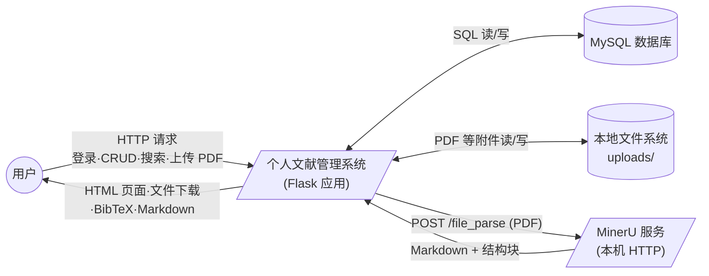
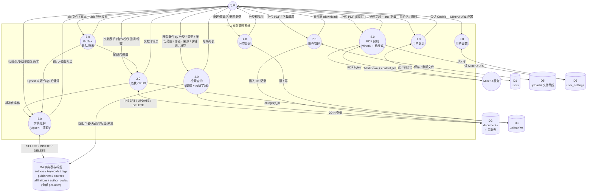

# 数据库 E-R 图与数据流图

本文档使用 [Mermaid](https://mermaid.js.org/) 描述系统的实体关系（E-R）与数据流（DFD）。

**渲染方式（任选其一）**：
- VS Code 安装扩展 *Markdown Preview Mermaid Support* 后直接打开本文件
- 把代码块粘到在线渲染器 <https://mermaid.live> ，可导出 PNG/SVG
- GitHub / GitLab 网页查看 `.md` 文件会自动渲染

---

## 一、E-R 图（实体关系图）

数据库共 **16 张表**，严格满足第三范式（3NF）。下图覆盖全部实体、属性和关系。

- 关系基数符号：`||` 一，`o{` 多
- `PK` = 主键，`FK` = 外键，`UK` = 唯一键（含联合唯一键）

```mermaid
erDiagram
    USERS                ||--o{ DOCUMENTS          : "拥有"
    USERS                ||--o{ CATEGORIES         : "拥有"
    USERS                ||--o{ AUTHORS            : "拥有(per-user 字典)"
    USERS                ||--o{ AFFILIATIONS       : "拥有(per-user 字典)"
    USERS                ||--o{ KEYWORDS           : "拥有(per-user 字典)"
    USERS                ||--o{ TAGS               : "拥有(per-user 标签)"
    USERS                ||--o{ PUBLISHERS         : "拥有(per-user 字典)"
    USERS                ||--o{ SOURCES            : "拥有(per-user 字典)"
    USERS                ||--o{ AUTHOR_CODES       : "同名计数器"
    USERS                ||--o| USER_SETTINGS      : "1:0..1 用户配置"
    CATEGORIES           ||--o{ CATEGORIES         : "父子层级"
    CATEGORIES           ||--o{ DOCUMENTS          : "归类"
    PUBLISHERS           ||--o{ SOURCES            : "出版"
    SOURCES              ||--o{ DOCUMENTS          : "刊载"
    DOCUMENTS            ||--o{ DOCUMENT_AUTHORS   : ""
    AUTHORS              ||--o{ DOCUMENT_AUTHORS   : ""
    DOCUMENTS            ||--o{ DOCUMENT_KEYWORDS  : ""
    KEYWORDS             ||--o{ DOCUMENT_KEYWORDS  : ""
    DOCUMENTS            ||--o{ DOCUMENT_TAGS      : ""
    TAGS                 ||--o{ DOCUMENT_TAGS      : ""
    AUTHORS              ||--o{ AUTHOR_AFFILIATIONS: ""
    AFFILIATIONS         ||--o{ AUTHOR_AFFILIATIONS: ""
    DOCUMENTS            ||--o{ FILES              : "附件"

    USERS {
        int      id            PK
        varchar  username      UK
        varchar  password_hash
        varchar  email         UK
        datetime created_at
    }

    CATEGORIES {
        int      id         PK
        int      user_id    FK
        int      parent_id  FK
        varchar  name
        datetime created_at
    }

    PUBLISHERS {
        int     id       PK
        int     user_id  FK "UK(user_id,name)"
        varchar name
        varchar address
        varchar website
    }

    SOURCES {
        int     id           PK
        int     user_id      FK "UK(user_id,name,type)"
        varchar name
        enum    type         "journal/conference/book_series/other"
        int     publisher_id FK
        varchar issn
    }

    AFFILIATIONS {
        int     id       PK
        int     user_id  FK "UK(user_id,name)"
        varchar name
        varchar address
    }

    AUTHORS {
        int      id      PK
        int      user_id FK "UK(user_id,name,code)"
        varchar  name
        smallint code    "同名作者用 #1/#2/... 区分"
    }

    AUTHOR_CODES {
        int     user_id   PK_FK
        varchar name      PK
        smallint next_code "下一个可分配的 code"
    }

    AUTHOR_AFFILIATIONS {
        int author_id      PK_FK
        int affiliation_id PK_FK
    }

    KEYWORDS {
        int     id      PK
        int     user_id FK "UK(user_id,name)"
        varchar name
    }

    TAGS {
        int     id      PK
        int     user_id FK "UK(user_id,name)"
        varchar name
    }

    DOCUMENTS {
        int      id               PK
        int      user_id          FK
        int      category_id      FK
        int      source_id        FK
        varchar  title
        text     abstract
        enum     document_type    "journal_article/conference_paper/book/thesis/report/other"
        smallint publication_year
        varchar  volume
        varchar  issue
        varchar  pages
        varchar  doi
        text     notes
        smallint rating
        enum     reading_status   "unread/reading/read"
        datetime created_at
        datetime updated_at
    }

    DOCUMENT_AUTHORS {
        int      document_id  PK_FK
        int      author_id    PK_FK
        smallint author_order
    }

    DOCUMENT_KEYWORDS {
        int document_id PK_FK
        int keyword_id  PK_FK
    }

    DOCUMENT_TAGS {
        int document_id PK_FK
        int tag_id      PK_FK
    }

    USER_SETTINGS {
        int     user_id    PK_FK
        varchar mineru_url "PDF 解析服务地址"
    }

    FILES {
        int      id            PK
        int      document_id   FK
        varchar  file_path
        varchar  original_name
        int      file_size
        varchar  mime_type
        datetime uploaded_at
    }
```

### 3NF 验证要点

| 范式 | 怎么落地 |
|---|---|
| 1NF | 所有列原子化；作者/关键词/标签/单位都拆到独立表，不存逗号分隔字符串 |
| 2NF | 联合主键的中间表（如 `document_authors`）的非主键属性 `author_order` 完全依赖于整个联合主键 |
| 3NF | 比如出版社不直接放在文献表，而是 `documents → sources → publishers` 链式依赖；单位通过 `author_affiliations` 间接关联作者，消除传递依赖 |

### 关于 per-user 字典与同名作者编号

- **字典表和标签均带 `user_id`**：`authors / affiliations / publishers / sources / keywords / tags` 都按用户隔离，不会出现 A 用户改名波及 B 用户的情况；唯一约束都升级为联合 `(user_id, name [, type/code])`。
- **同名作者编号**：`authors` 增加 `code` 列，配合 `author_codes(user_id, name) → next_code` 计数器，让同一个用户库里多位"张三"以 `张三#1`、`张三#2` 等区分。表单录入走严格模式（同名必须显式选择 `#N` 或标记为新人）；BibTeX 批量导入走宽松模式（复用最低 `code`）。

---

## 二、数据流图（DFD）

### 顶层图（Context Diagram / Level 0）

系统作为一个整体，展示与外部实体的交互。



### 1 层 DFD（主要功能分解）

展开系统内部的核心处理过程与数据存储。

- 圆形：处理过程（Process）
- 圆柱：数据存储（Data Store）
- 椭圆：外部实体



### 关键数据流说明

| 编号 | 来源 → 去向 | 数据内容 |
|---|---|---|
| 1 | 用户 → 2.0 | 标题、摘要、作者文本、关键词、标签、年份、来源、附件等 |
| 2 | 2.0 → 5.0 | 待 upsert 的作者名（含编号 `#N` 或 `new`）/ 单位 / 关键词 / 标签 / 期刊 / 出版社 |
| 3 | 5.0 → D4 | "查或建" 标准化实体（在 `user_id` 内唯一） |
| 4 | 2.0 → D2 | 新增 / 更新 / 删除文献主记录及关联表 |
| 5 | 3.0 → 用户 | 经多表 JOIN 后聚合的文献结果列表 |
| 6 | 7.0 → D5 | 重命名后的 PDF 文件（`uploads/<user_id>/<uuid>.pdf`） |
| 7 | 6.0 → 2.0 | BibTeX 解析得到的字段，再走标准 CRUD 流程入库 |
| 8 | 8.0 → MinerU | PDF 文件字节（前 3 页） |
| 9 | MinerU → 8.0 | Markdown 文本 + 结构化 content_list |
| 10 | 9.0 → D6 | per-user 的 MinerU 服务地址等配置 |

---

## 三、用例 → 数据存储 矩阵（辅助视图）

| 用例 / 数据存储     | D1 users | D2 documents | D3 categories | D4 字典/标签 | D5 文件 | D6 设置 |
|---|---|---|---|---|---|---|
| 注册 / 登录         | C / R    |              |               |          |          |          |
| 新建文献            |          | C            | R             | C / R    | C        |          |
| 编辑文献            |          | U            | R             | C / R    | C        |          |
| 删除文献            |          | D            |               | D (孤儿) | D        |          |
| 搜索                |          | R            |               | R        |          |          |
| 分类管理            |          | U (解绑)     | C / U / D     |          |          |          |
| 字典表维护 / 清理   |          |              |               | R / D    |          |          |
| BibTeX 导入         |          | C            |               | C / R    |          |          |
| BibTeX 导出         |          | R            |               | R        |          |          |
| 附件上传 / 下载     |          | C / R        |               |          | C / R / D |        |
| PDF 识别            |          |              |               |          |          | R        |
| 用户设置            |          |              |               |          |          | C / R / U|

C = Create, R = Read, U = Update, D = Delete
