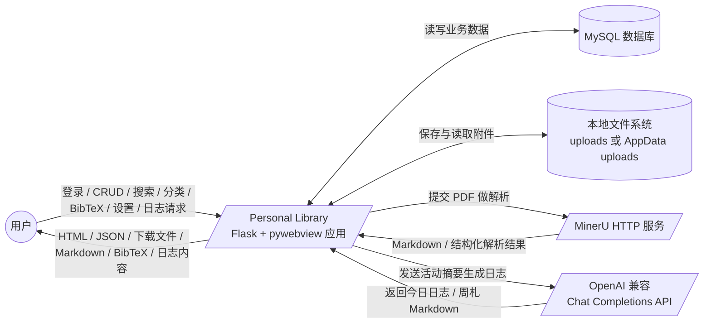
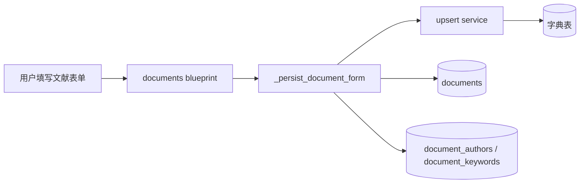
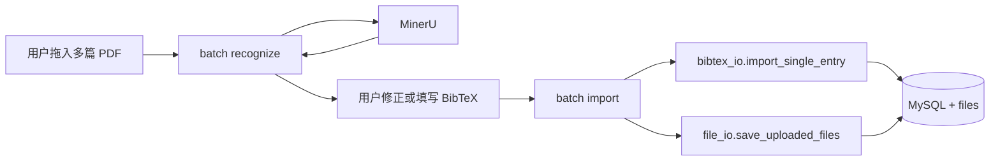
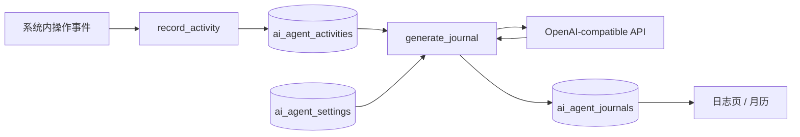
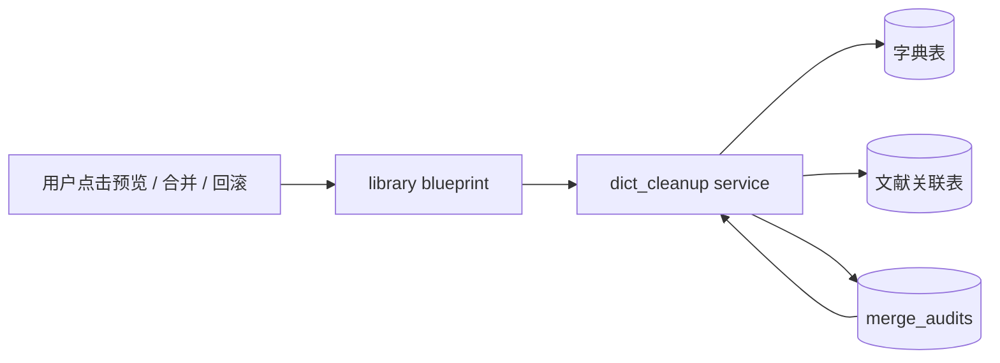

# 数据库 E-R 图与数据流图

本文档基于当前版本代码，使用 [Mermaid](https://mermaid.js.org/) 描述：

1. 数据库实体关系图（E-R）
2. 系统级数据流图（DFD）
3. 关键业务流的辅助视图

如果以后模型或路由继续演进，这份文档也应同步更新。

## 渲染方式

1. 在支持 Mermaid 的 Markdown 预览器中直接打开。
2. 复制代码块到 [Mermaid Live](https://mermaid.live/)。
3. GitHub / GitLab 查看时通常可直接渲染。

---

## 一、E-R 图

当前数据库核心上已经不是早期版本的 14 张表，而是扩展为以下几类：

1. 账号与基础业务表
2. per-user 字典表
3. 文献关联表
4. 用户设置表
5. AI Agent / 日志表
6. 字典合并审计表

### 1.1 全量实体关系图

说明：

1. `||` 表示一
2. `o{` 表示多
3. `PK` 为主键，`FK` 为外键，`UK` 为唯一约束

```mermaid
erDiagram
    USERS                ||--o{ DOCUMENTS            : "拥有文献"
    USERS                ||--o{ CATEGORIES           : "拥有分类"
    USERS                ||--o{ AUTHORS              : "拥有作者字典"
    USERS                ||--o{ AFFILIATIONS         : "拥有单位字典"
    USERS                ||--o{ KEYWORDS             : "拥有关键词字典"
    USERS                ||--o{ PUBLISHERS           : "拥有出版社字典"
    USERS                ||--o{ SOURCES              : "拥有来源字典"
    USERS                ||--o{ AUTHOR_CODES         : "拥有同名计数器"
    USERS                ||--o| USER_SETTINGS        : "MinerU 设置"
    USERS                ||--o| AI_AGENT_SETTINGS    : "AI Agent 设置"
    USERS                ||--o{ AI_AGENT_ACTIVITIES  : "活动日志"
    USERS                ||--o{ AI_AGENT_JOURNALS    : "生成日志"
    USERS                ||--o{ MERGE_AUDITS         : "合并审计"

    CATEGORIES           ||--o{ CATEGORIES           : "父子层级"
    CATEGORIES           ||--o{ DOCUMENTS            : "分类下文献"

    PUBLISHERS           ||--o{ SOURCES              : "出版来源"
    SOURCES              ||--o{ DOCUMENTS            : "来源下文献"

    AUTHORS              ||--o{ DOCUMENT_AUTHORS     : "参与文献"
    DOCUMENTS            ||--o{ DOCUMENT_AUTHORS     : "包含作者"

    KEYWORDS             ||--o{ DOCUMENT_KEYWORDS    : "对应文献"
    DOCUMENTS            ||--o{ DOCUMENT_KEYWORDS    : "包含关键词"

    AUTHORS              ||--o{ AUTHOR_AFFILIATIONS  : "作者单位关联"
    AFFILIATIONS         ||--o{ AUTHOR_AFFILIATIONS  : "单位作者关联"

    DOCUMENTS            ||--o{ FILES                : "附件"

    MERGE_AUDITS         ||--o| MERGE_AUDITS         : "回滚指向原审计"

    USERS {
        int      id             PK
        varchar  username       UK
        varchar  password_hash
        varchar  email          UK
        datetime created_at
    }

    CATEGORIES {
        int      id             PK
        int      user_id        FK
        int      parent_id      FK
        varchar  name
        datetime created_at
    }

    PUBLISHERS {
        int      id             PK
        int      user_id        FK
        varchar  name
        varchar  address
        varchar  website
    }

    SOURCES {
        int      id             PK
        int      user_id        FK
        varchar  name
        enum     type
        int      publisher_id   FK
        varchar  issn
    }

    AFFILIATIONS {
        int      id             PK
        int      user_id        FK
        varchar  name
        varchar  address
    }

    AUTHORS {
        int      id             PK
        int      user_id        FK
        varchar  name
        smallint code
    }

    AUTHOR_CODES {
        int      user_id        PK_FK
        varchar  name           PK
        smallint next_code
    }

    AUTHOR_AFFILIATIONS {
        int      author_id      PK_FK
        int      affiliation_id PK_FK
    }

    KEYWORDS {
        int      id             PK
        int      user_id        FK
        varchar  name
    }

    TAGS {
        int     id      PK
        int     user_id FK "UK(user_id,name)"
        varchar name
    }

    DOCUMENTS {
        int      id               PK
        int      user_id          FK
        int      category_id      FK
        int      source_id        FK
        varchar  title
        text     abstract
        enum     document_type
        smallint publication_year
        varchar  volume
        varchar  issue
        varchar  pages
        varchar  doi
        text     notes
        smallint rating
        enum     reading_status
        datetime created_at
        datetime updated_at
    }

    DOCUMENT_AUTHORS {
        int      document_id    PK_FK
        int      author_id      PK_FK
        smallint author_order
    }

    DOCUMENT_KEYWORDS {
        int      document_id    PK_FK
        int      keyword_id     PK_FK
    }

    DOCUMENT_TAGS {
        int document_id PK_FK
        int tag_id      PK_FK
    }

    USER_SETTINGS {
        int      user_id        PK_FK
        varchar  mineru_url
    }

    AI_AGENT_SETTINGS {
        int      user_id        PK_FK
        varchar  agent_name
        boolean  enabled
        float    scale
        varchar  facing
        int      position_x
        int      position_y
        varchar  api_url
        varchar  api_key
        varchar  model
        datetime created_at
        datetime updated_at
    }

    AI_AGENT_ACTIVITIES {
        int      id             PK
        int      user_id        FK
        varchar  event_type
        varchar  label
        text     metadata_json
        datetime created_at
    }

    AI_AGENT_JOURNALS {
        int      id             PK
        int      user_id        FK
        enum     period
        date     start_date
        date     end_date
        varchar  title
        text     content
        datetime created_at
        datetime updated_at
    }

    MERGE_AUDITS {
        int      id             PK
        int      user_id        FK
        enum     action
        int      target_audit_id FK
        text     summary_json
        text     payload_json
        datetime rolled_back_at
        datetime created_at
    }

    FILES {
        int      id             PK
        int      document_id    FK
        varchar  file_path
        varchar  original_name
        int      file_size
        varchar  mime_type
        datetime uploaded_at
    }
```

### 1.2 唯一约束与设计要点

#### per-user 字典

下列字典都按用户隔离，不同用户互不影响：

1. `authors`
2. `affiliations`
3. `keywords`
4. `publishers`
5. `sources`

关键唯一约束：

1. `authors`: `UK(user_id, name, code)`
2. `affiliations`: `UK(user_id, name)`
3. `keywords`: `UK(user_id, name)`
4. `publishers`: `UK(user_id, name)`
5. `sources`: `UK(user_id, name, type)`

#### 同名作者消歧

`authors.code` 与 `author_codes.next_code` 配合使用：

1. 表单严格录入时，可显式选择现有 `#code`
2. 新建同名作者时，系统分配新的递增 `code`
3. BibTeX 导入走宽松模式，默认复用最低 `code`

#### AI 日志体系

AI 相关不是单表，而是 3 张表协作：

1. `ai_agent_settings`
   保存用户的 AI Agent 配置。
2. `ai_agent_activities`
   保存系统操作事件流。
3. `ai_agent_journals`
   保存生成后的日 / 周日志。

#### 合并审计

`merge_audits` 不是普通日志表，它还承担回滚入口：

1. `merge_apply` 记录一次合并操作的摘要和载荷
2. `merge_rollback` 记录一次回滚动作
3. `target_audit_id` 指向被回滚的那条合并审计

### 1.3 3NF 说明

| 范式 | 当前如何体现 |
|---|---|
| 1NF | 作者、关键词、单位、来源、附件都拆成独立实体，不在主表存逗号字符串 |
| 2NF | 多对多中间表如 `document_authors`、`document_keywords`、`author_affiliations` 的字段都完整依赖联合键 |
| 3NF | 文献不直接冗余出版社字段，而是通过 `documents -> sources -> publishers`；作者与单位通过关联表解耦；AI 日志与设置也按职责拆表 |

---

## 二、数据流图（DFD）

下面的数据流图重点反映当前版本新增的三块能力：

1. 批量 PDF + BibTeX 入库
2. 字典治理与合并回滚
3. AI Agent 活动记录与日志生成

### 2.1 顶层图（Context Diagram / Level 0）



### 2.2 1 层 DFD（主要功能分解）

```mermaid
flowchart TB
    User((用户))
    MinerU((MinerU))
    AI((OpenAI-compatible API))

    subgraph SYS["Personal Library"]
        P1(("1.0<br/>用户认证"))
        P2(("2.0<br/>文献 CRUD"))
        P3(("3.0<br/>检索与详情"))
        P4(("4.0<br/>分类管理"))
        P5(("5.0<br/>字典治理"))
        P6(("6.0<br/>BibTeX 导入导出"))
        P7(("7.0<br/>附件管理"))
        P8(("8.0<br/>PDF 识别"))
        P9(("9.0<br/>用户设置"))
        P10(("10.0<br/>批量 PDF + BibTeX 入库"))
        P11(("11.0<br/>AI Agent 活动记录"))
        P12(("12.0<br/>AI 日志生成与月历展示"))
    end

    D1[("D1 users")]
    D2[("D2 documents")]
    D3[("D3 categories")]
    D4[("D4 字典表<br/>authors / affiliations / keywords / publishers / sources / author_codes")]
    D5[("D5 document_authors / document_keywords")]
    D6[("D6 files + 文件系统")]
    D7[("D7 user_settings")]
    D8[("D8 ai_agent_settings")]
    D9[("D9 ai_agent_activities")]
    D10[("D10 ai_agent_journals")]
    D11[("D11 merge_audits")]

    User -- "注册 / 登录 / 退出" --> P1
    P1 <-- "读写账号" --> D1
    P1 -- "会话与页面" --> User

    User -- "新增 / 编辑 / 删除文献表单" --> P2
    P2 <-- "文献主记录" --> D2
    P2 <-- "作者/关键词关联" --> D5
    P2 -- "字典标准化请求" --> P5
    P2 -- "上传文件" --> P7
    P2 -- "记录事件" --> P11
    P2 -- "详情页 / 列表跳转" --> User

    User -- "搜索条件 / 查看详情" --> P3
    P3 <-- "文献查询" --> D2
    P3 <-- "作者关键词关联" --> D5
    P3 <-- "字典查询" --> D4
    P3 <-- "附件信息" --> D6
    P3 -- "结果页" --> User

    User -- "新建 / 重命名 / 删除分类" --> P4
    P4 <-- "读写分类树" --> D3
    P4 -- "分类视图" --> User

    User -- "扫描孤立项 / 合并 / 回滚" --> P5
    P5 <-- "读写字典项" --> D4
    P5 <-- "重写文献关联" --> D5
    P5 <-- "读写审计记录" --> D11
    P5 -- "治理结果" --> User
    P5 -- "治理事件" --> P11

    User -- ".bib 文本 / 文件 / 导出请求" --> P6
    P6 -- "解析后入库请求" --> P2
    P6 <-- "文献读取" --> D2
    P6 <-- "关联读取" --> D5
    P6 <-- "字典补全" --> D4
    P6 -- ".bib 文件 / 导入结果" --> User
    P6 -- "BibTeX 事件" --> P11

    User -- "附件上传 / 下载 / 删除" --> P7
    P7 <-- "附件元数据" --> D6
    P7 -- "文件读写" --> D6
    P7 -- "文件流 / 删除结果" --> User
    P7 -- "附件事件" --> P11

    User -- "单篇 PDF 识别请求" --> P8
    P8 <-- "读取 MinerU URL" --> D7
    P8 -- "PDF bytes" --> MinerU
    MinerU -- "Markdown + 结构化结果" --> P8
    P8 -- "建议字段 / Markdown 下载" --> User
    P8 -- "识别事件" --> P11

    User -- "MinerU / AI Agent 配置" --> P9
    P9 <-- "读写 MinerU 设置" --> D7
    P9 <-- "读写 AI Agent 设置" --> D8
    P9 -- "保存结果" --> User
    P9 -- "设置事件" --> P11

    User -- "拖入多篇 PDF + 填写 bib" --> P10
    P10 <-- "读取 MinerU URL" --> D7
    P10 -- "批量 PDF 识别" --> MinerU
    MinerU -- "Markdown" --> P10
    P10 -- "逐篇导入" --> P2
    P10 -- "批量导入结果" --> User
    P10 -- "批量导入事件" --> P11

    P11 <-- "写入活动记录" --> D9

    User -- "生成今日日志 / 本周周札 / 查看月历" --> P12
    P12 <-- "读取 AI 设置" --> D8
    P12 <-- "读取活动流" --> D9
    P12 -- "调用日志生成" --> AI
    AI -- "日志 Markdown" --> P12
    P12 <-- "保存 / 查询日志" --> D10
    P12 -- "日志结果 / 月历视图" --> User
    P12 -- "日志生成事件" --> P11
```



### 2.3 关键数据流说明

| 编号 | 来源 -> 去向 | 数据内容 |
|---|---|---|
| 1 | 用户 -> 2.0 | 文献表单：标题、摘要、作者、关键词、来源、评分、笔记、分类等 |
| 2 | 2.0 -> 5.0 | 待标准化的作者、单位、关键词、来源、出版社 |
| 3 | 5.0 -> D4 | per-user 字典项查找、创建、合并、删除 |
| 4 | 2.0 -> D2 / D5 | 文献主记录与作者/关键词关联关系 |
| 5 | 7.0 -> D6 | 附件元数据与实际文件保存 |
| 6 | 8.0 -> MinerU | 单篇 PDF 文件字节 |
| 7 | 10.0 -> MinerU | 批量识别阶段的 PDF 文件字节 |
| 8 | D9 -> 12.0 | 用户活动事件流，作为 AI 日志输入素材 |
| 9 | 12.0 -> AI | `messages` 形式的日志生成请求 |
| 10 | AI -> 12.0 | 生成后的 Markdown 日志内容 |
| 11 | 5.0 -> D11 | 合并与回滚的审计摘要、可回滚载荷 |
| 12 | 9.0 -> D7 / D8 | MinerU 设置与 AI Agent 配置 |

---

## 三、关键业务辅助图

### 3.1 文献录入与标准化



### 3.2 批量 PDF + BibTeX 入库



### 3.3 AI 日志生成



### 3.4 字典治理与回滚



---

## 四、用例与数据存储矩阵

| 用例 / 数据存储 | users | documents | categories | 字典表 | 关联表 | files | user_settings | ai_agent_settings | ai_agent_activities | ai_agent_journals | merge_audits |
|---|---|---|---|---|---|---|---|---|---|---|---|
| 注册 / 登录 | C / R |  |  |  |  |  |  |  | C |  |  |
| 新建文献 |  | C | R | C / R | C / U | C |  |  | C |  |  |
| 编辑文献 |  | U | R | C / R | U | C / D |  |  | C |  |  |
| 删除文献 |  | D |  | 间接受影响 | D | D |  |  | C |  |  |
| 搜索与详情 |  | R | R | R | R | R |  |  |  |  |  |
| 分类管理 |  | U | C / U / D |  |  |  |  |  |  |  |  |
| 字典清理 |  |  |  | R / D | R |  |  |  | C |  | C |
| 字典合并 / 回滚 |  |  |  | U | U |  |  |  | C |  | C |
| BibTeX 导入 |  | C | 可选 R | C / R | C |  |  |  | C |  |  |
| BibTeX 导出 |  | R |  | R | R |  |  |  | C |  |  |
| 单篇 PDF 识别 |  |  |  |  |  |  | R |  | C |  |  |
| 批量 PDF + BibTeX 入库 |  | C | 可选 R | C / R | C | C | R |  | C |  |  |
| 保存 MinerU 设置 |  |  |  |  |  |  | C / R / U |  | C |  |  |
| 保存 AI Agent 设置 |  |  |  |  |  |  |  | C / R / U | C |  |  |
| 生成今日日志 / 周札 |  |  |  |  |  |  |  | R | R | C / U / R |  |
| 查看日志月历 |  |  |  |  |  |  |  |  |  | R |  |

说明：

1. “字典表”指 `authors / affiliations / keywords / publishers / sources / author_codes`
2. “关联表”指 `document_authors / document_keywords / author_affiliations`
3. `C / R / U / D` 分别表示 Create / Read / Update / Delete

---

## 五、维护建议

每次出现以下变更时，这份文档都应同步：

1. `app/models.py` 新增或删除表
2. 新增一个独立业务蓝图
3. 外部服务接入方式变化
4. 文献主流程、批量导入流程或 AI 日志流程发生重构

当前版本最容易漏同步的区域有：

1. AI Agent 相关表与接口
2. `merge_audits` 的回滚链路
3. 批量 PDF + BibTeX 入库流程
